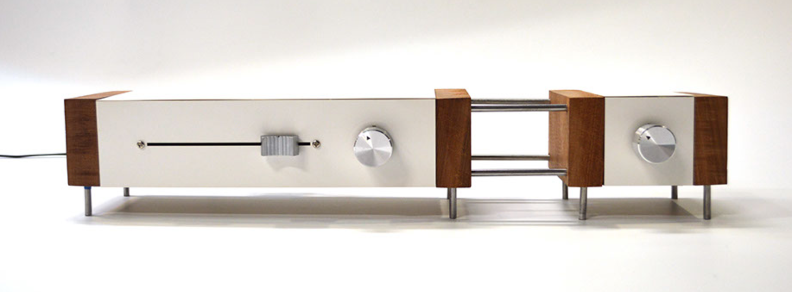
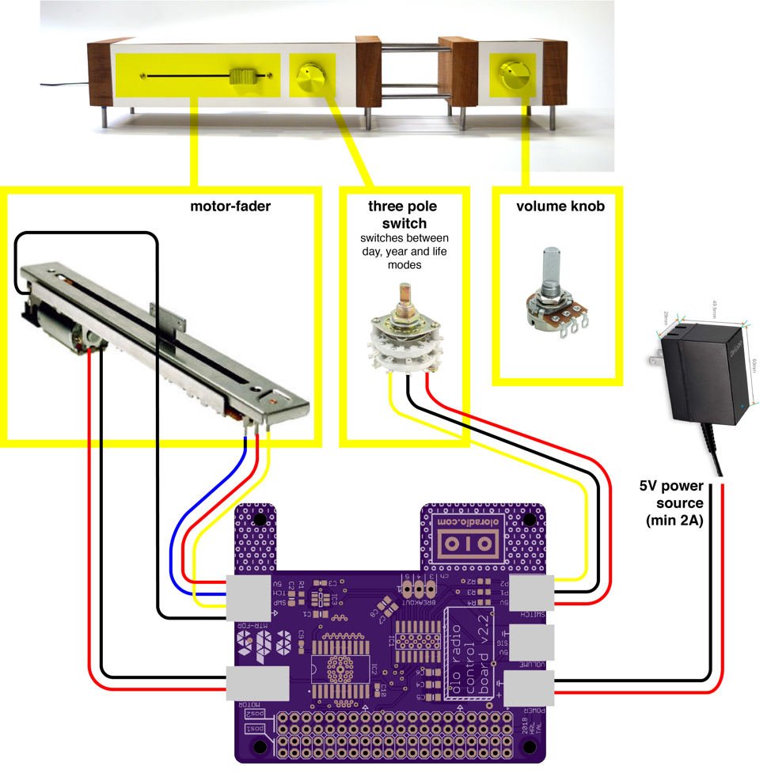
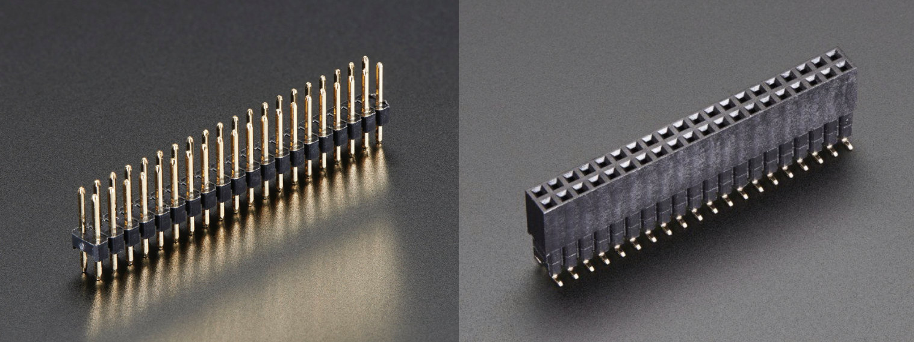

# [OLO radio 📻](http://oloradio.com)
_A Radio to resurface songs from your past._


## Installation
Follow these instructions to setup a new OLO product. <br><br>
If you already have a SD card from a working OLO, follow [this instruction](https://thepihut.com/blogs/raspberry-pi-tutorials/17789160-backing-up-and-restoring-your-raspberry-pis-sd-card) to create an SD card image and load on to the new card. This would only take about ~15 minutes to create an image, and <10 minutes to load. Once finished, insert the copied card and you're ready to go! <br><br> Otherwise, let's create a brand-new OLO :)

### Format SD Card
Follow instructions [HERE](https://www.raspberrypi.org/documentation/installation/sdxc_formatting.md).


### Install OS
Choose one of two links below to install Raspbian OS. Set id/pw to `pi/oloradio`. You can change the password directly in Raspberry Pi configuration settings: `sudo raspi-config`.

* [NOOBS installer](https://www.raspberrypi.org/downloads/noobs/)

* [Raspbian-Lite released by HiFiBerry](https://www.hifiberry.com/build/download/)
	* Default id/pw is `pi/raspberry`, [change the password](https://vicpimakers.ca/tutorials/raspbian/change-the-raspbian-root-password/) to: `pi/oloradio`


### Install GUI (Raspbian Lite Only)
First, run `sudo df -h` to check the volume of the root partition. If it's less than 16.0 G, resize the partition volume. Follow the guide in the [EverydayDesignStudio's guide](https://github.com/EverydayDesignStudio/guides/blob/master/raspberry-advanced.md).

Once you confirm that you have enough space for the root partition, follow the article to [installing GUI on Raspbian Lite](https://www.raspberrypi.org/forums/viewtopic.php?t=133691). It will guide you through setting time zones, locales, keyboard settings and packages for GUI.

**GUI is required for OLO to retrieve an authentication token for the Spotify Web API. **

Install [VNC](https://www.raspberrypi.org/documentation/remote-access/vnc/) to enable remote control with GUI.


### Set Alias

1. Open `sudo nano ~/.bashrc`
2. Add the following on the bottom:```alias python=python3```


### Register Scripts
Register `oloLauncher.sh` and `oloUpdater.sh` scripts to [automatically start and update on boot](https://www.instructables.com/id/Raspberry-Pi-Launch-Python-script-on-startup/).
1. Navigate to OLO folder:<br> `cd Desktop/olo`
2. Make two scripts executable:<br> `sudo chmod 755 oloLauncher.sh`<br> `sudo chmod 755 oloUpdater.sh`
3. Open [Crontab](https://www.adminschoice.com/crontab-quick-reference):<br> `sudo crontab -e`
4. Add two lines on the bottom to register scripts to run at a specific time: <br> `@reboot sh /home/pi/Desktop/olo/oloLauncher.sh`<br> `0 4 * * * sh /home/pi/Desktop/olo/oloUpdater.sh`


### Download Source Code
`cd ~/Desktop | git clone https://github.com/EverydayDesignStudio/olo.git`

* If you get an error because you have not set up the Git or Github, see [Git guide](https://everydaydesignstudio.github.io/guides/git-github.html)


## Install Packages
Fresh Raspbian OS will have Python2, Python3 and Git installed by default


#### Libraries

1. Update apt-get, Pi and Python

 `sudo apt-get update`

 `sudo apt-get install build-essential python-pip python3-pip python-dev git`

 `sudo apt-get install python-smbus`

 `sudo apt-get upgrade`

 `sudo pip3 install --upgrade setuptools`
 (if this doesn't work, try `sudo apt-get install python3-pip`)

2. Enable **[I2C](https://learn.adafruit.com/adafruits-raspberry-pi-lesson-4-gpio-setup/configuring-i2c)** and **[SPI](https://learn.adafruit.com/adafruits-raspberry-pi-lesson-4-gpio-setup/configuring-spi)** channels

3. Install **Circuitpython Adafruit libraries**

 GPIO: `sudo pip3 install RPI.GPIO`

 Adafruit Blinka: `sudo pip3 install adafruit-blinka`

 Adafruit [MCP3008](https://learn.adafruit.com/mcp3008-spi-adc/python-circuitpython): `sudo pip3 install adafruit-circuitpython-mcp3xxx`

4. Packages for the back-end code

 * [sqlite3](https://www.tutorialspoint.com/sqlite/sqlite_installation.htm):
`sudo apt-get install sqlite3`

 * [raspotify](https://github.com/dtcooper/raspotify): `curl -sL https://dtcooper.github.io/raspotify/install.sh | sh`
 <br>Need to [modify the config]((https://github.com/dtcooper/raspotify#Configuration)) and restart raspotify
						`sudo systemctl restart raspotify`

 * [spotipy](https://github.com/plamere/spotipy):
`sudo python3 -m pip install spotipy`
`sudo python3 -m pip install git+https://github.com/plamere/spotipy.git --upgrade`
<br>If there is an error saying `Spotipy (or Spotify) object does not have an attribute ...`, locate the spotipy package `pip show spotipy` and replace `client.py` to the latest code from [HERE](https://raw.githubusercontent.com/plamere/spotipy/master/spotipy/client.py)


 * [pylast](https://github.com/pylast/pylast):
  `sudo python3 -m pip install pylast`


### Configure [Hifiberry](https://www.hifiberry.com/)
* Skip this step if you installed Raspbian-Lite, released by HiFiBerry.

Follow the instructions [HERE](https://www.hifiberry.com/build/documentation/configuring-linux-3-18-x/).
Use "DAC+ standard/pro".

In `/boot/config.txt`,
> dtoverlay=hifiberry-dacplus


### Enable ssh for the remote control
- Top left menu > Config > check "Enable SSH"

- OR, run the following command:
 `sudo systemctl enable ssh | sudo systemctl start ssh`


### (Optional) Enable VNC
`sudo raspi-config` > "5. Interfacing options" > check "Enable VNC"


---

## Hardware
The purple OLO PCB (control board) connects the several hardware parts to the raspberry pi. These components are illustrated in figure 1. Make sure the board is connected to a 5V power source (min. 15W); the DC-DC converter (labelled ‘power supply’) in combination with the 9V 2A power adapter suffices. In figure 1, you can also see how these components are connected to the control board. Every white connector on the control board is labeled with white lettering on the board itself to denote what is connected to it. For the purpose of not mistaking the two, the power connector and the motor connector are a different type of connector. The volume knob and the three-pole switch though, are identical; so keep that in mind if you ever need to connect these.


_The OLO radio control board and its components_

---

### Interfacing with OLO components
In order to interface with the components (through the olo PCB), make sure that the olo PCB is connected to the RPi properly. The RPi has a 2x20 male header (see figure 2) which fits the olo PCB. You might notice that the OLO PCB (v2.2) hits the Ethernet adapter when connected directly on the RPi. This is going to be fixed in later revisions of the board, but is not an issue that impedes the functionality of the board.

When the OLO PCB is connected to the RPi, make sure the RPi is connected to a 5V power source (such as a 5V power adapter that can be plugged into the mains). When the RPi is powered up, a power LED should light up on the RPi.


_A 2x20 male header (left) and a 2x20 female header (right)_

### Coding
When writing code for OLO, import the `oloFunctions.py` file into your python code. In this file, functions are defined for several functionalities, briefly described in each functions’ comments. You will find that oloFunctions.py is imported in several other scripts in the olo repository. Another recurring file is sh.py; this file contains global variables that are shared between scripts.

When using `sh.py` in your file, make sure to both import it: `import sh`

As well as initialize it: `sh.init()`

The latter simply calls a function inside sh.py that initializes all global variables.
For more information on the hardware components, I would advise on doing a web search on the parts’ model number. Datasheets of the ALPS motor-fader and most components that are on the OLO board can be found in the olo folder on the EDS dropbox.

---
**[Home](README.md)** | **[Capra](capra.md)**
